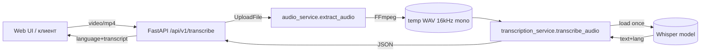
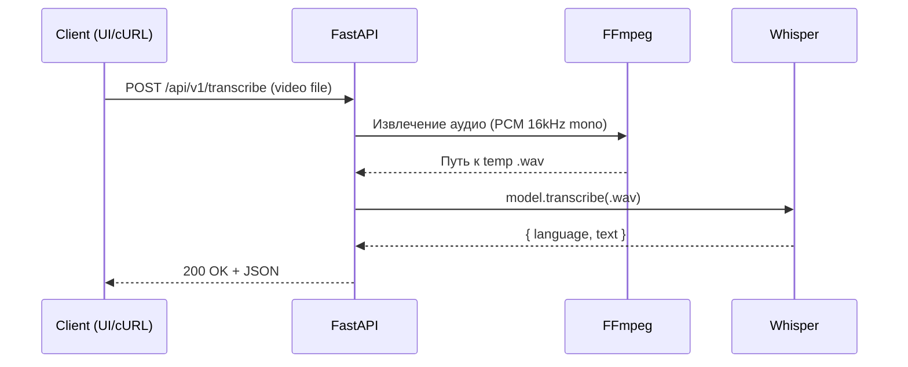

# Sparq Voice Recognition API — Документация и README

---

## Что это такое
Лёгкий API‑сервис на **FastAPI** для транскрибации речи из видеофайлов с помощью **OpenAI Whisper**. На вход — видео, на выход — язык и текст. Есть простой Web UI для ручной загрузки, Docker‑окружение и автотесты.

**Стек:** Python, FastAPI, Uvicorn, FFmpeg (через `ffmpeg-python`), OpenAI Whisper, Docker, PyTest.

**Ключевые фичи**
- `POST /api/v1/transcribe` — принимает видео и возвращает JSON с языком и транскриптом.
- `GET /` — статический Web UI для загрузки и проверки.
- `GET /docs` — интерактивная OpenAPI‑спецификация.
- Безопасная обработка временных файлов (видео→аудио→удаление).
- Ленивая загрузка модели Whisper по первому запросу.

---

## Структура проекта
```
Sparq_voice_recognition-master/
├─ app/
│  ├─ main.py                    # Точка входа FastAPI, маршруты и статик
│  ├─ core/
│  │  └─ config.py               # Конфиг: выбор модели WHISPER_MODEL
│  ├─ services/
│  │  ├─ audio_service.py        # Извлечение аудио из видео (FFmpeg)
│  │  └─ transcription_service.py# Загрузка и вызов Whisper, пост-очистка
│  ├─ api/
│  │  └─ v1/endpoints/transcription.py  # REST‑эндпоинт транскрибации
│  └─ static/index.html          # Простая страница загрузки видео
├─ tests/
│  ├─ test_api.py                # Юнит‑тесты API
│  └─ test_data/*.mp4            # Тестовые видео (в т.ч. «тихий» ролик)
├─ requirements.txt              # Зависимости
├─ Dockerfile                    # Продакшен‑сборка
└─ README.md                     # (заменить на этот файл)
```

---

## Как это работает (визуализация)

### Поток данных


### Последовательность действий


---

## API
### POST `/api/v1/transcribe`
**Форма:** `multipart/form-data` с полем `file` (видео — `content_type` начинается с `video/`).

**Успешный ответ (200):**
```json
{
  "video_id": "550e8400-e29b-41d4-a716-446655440000",
  "language": "en",
  "transcript": "Hello world ..."
}
```

**Ошибки:**
- `400` — неправильный тип файла (не `video/*`).
- `500` — внутренняя ошибка при извлечении аудио/транскрипции.

**cURL пример:**
```bash
curl -X POST \
  -F "file=@/path/to/video.mp4" \
  http://localhost:8000/api/v1/transcribe
```

---

## Локальный запуск
### 1) Установка зависимостей
```bash
python -m venv .venv && source .venv/bin/activate
pip install -r requirements.txt
```
Понадобится установленный **FFmpeg** в системе (`ffmpeg` в PATH).

### 2) Переменные окружения
- `WHISPER_MODEL` — название модели Whisper: `tiny | base | small | medium | large` (по умолчанию `base`).

### 3) Старт дев‑сервера
```bash
uvicorn app.main:app --reload --port 8000
```
После запуска:
- Web UI: `http://localhost:8000/`
- Документация: `http://localhost:8000/docs`

---

## Запуск в Docker
```bash
docker build -t sparq-vr .
docker run --rm -p 8000:8000 -e WHISPER_MODEL=base --name sparq-app sparq-vr
```
> Контейнер собран для прод‑режима на Uvicorn. Не забудьте выделить достаточно памяти для модели.

---

## Тесты
```bash
pytest -q
```
Включены проверки:
- Транскрипция «тихого» видео возвращает пустой текст и `200 OK`.
- Валидация неверного `content_type` → `400 Bad Request`.

---

## Детали реализации
- **`audio_service.extract_audio`**: сохраняет загруженное видео во временный файл и через `ffmpeg` извлекает **mono 16kHz PCM** `.wav`, затем чистит временные артефакты.
- **`transcription_service.transcribe_audio`**: лениво загружает модель (`whisper.load_model`), вызывает `model.transcribe(fp16=False)`, удаляет временный `.wav`.
- **`api/v1/endpoints/transcription.py`**: проверка `content_type`, склейка сервиса аудио и сервиса транскрипции, единый обработчик ошибок, генерация `video_id (uuid4)`.

---

## Производительность и модель
- Whisper модели существенно отличаются по **качеству/скорости/памяти**. Для сервера с 4–8 ГБ RAM разумно начать с `base/small`.
- Для GPU‑ускорения можно убрать `fp16=False` (оставить по умолчанию) и запускать на CUDA‑окружении.
- На CPU большие модели (`medium/large`) могут быть очень медленными.

---

## Безопасность и ограничения
- Временные файлы удаляются в `finally`, но при внезапном падении окружения имеет смысл запускать периодическую очистку `/tmp`.
- Лимит размера видео стоит контролировать через **reverse‑proxy** (Nginx) и FastAPI‑настройки.
- Сейчас нет очереди/асинхронной фоновой обработки — долгие запросы держат соединение.

---

## Расширения (roadmap)
- [ ] Поддержка **форматов аудио** (не только видео) в том же эндпоинте.
- [ ] Возврат **таймкодов** по фразам/словам.
- [ ] Стрим‑режим / фоновые задания (Celery/RQ) + вебхуки.
- [ ] Авторизация (API‑ключи) и лимиты запросов.
- [ ] Логи/метрики (Prometheus + Grafana).

---

## FAQ
**Где менять модель?** — в переменной окружения `WHISPER_MODEL` или `app/core/config.py`.

**Нужно ли отдельно ставить FFmpeg?** — Да, бинарь `ffmpeg` должен быть в PATH (в Docker уже включён через базовый образ).

**Как быстро проверить?** — откройте `http://localhost:8000/`, загрузите `.mp4` и смотрите JSON‑ответ.
